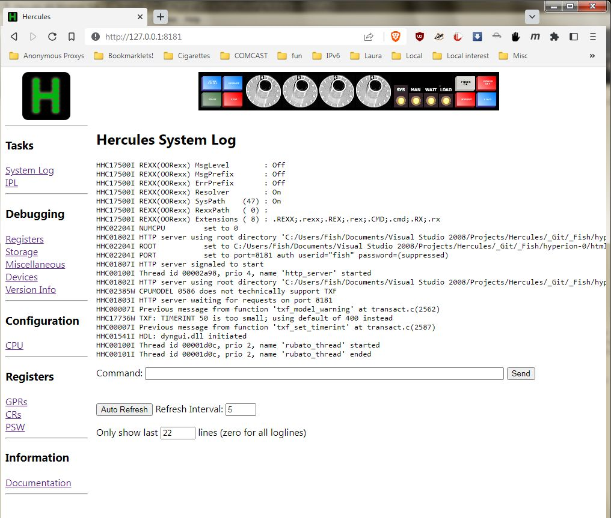

[Return to master README.md](../README.md)

# Running Hercules in Daemon mode

## Contents

1. [Introduction](#Introduction)
2. [How to run in daemon mode](#How-to-run-in-daemon-mode)
3. [Using the HTTP Server to control Hercules running in daemon mode](#Using-the-HTTP-Server-to-control-Hercules-running-in-daemon-mode)

## Introduction

In addition to being able to run Hercules in normal Panel mode or in External GUI mode, it is also able to run in a mode known as Daemon mode.

A daemon is a computer program that runs as a background process (usually, but not always, invisibly), rather than being under the direct control of an interactive user. On Windows platforms these are known as [services](https://en.wikipedia.org/wiki/Windows_service). On Unix and related platforms, they are known as [daemons](https://en.wikipedia.org/wiki/Daemon_(computing)), but the concept is the same.

Running Hercules in daemon mode allows you to start an instance of Hercules (with no terminal/panel user interface) that continues to run, even should you decide to logoff from your host operating system.

This can prove to be quite convenient when using Hercules as a [Shared Device Server](https://sdl-hercules-390.github.io/html/shared.html) that, by serving other Hercules Shared Device Client instances, must therefore always be running (whereas the normal Hercules client instances can come and go (startup and shutdown) at will, any time they want).

## How to run in daemon mode

To run Hercules in daemon mode, simply specify the `--daemon` or `-d` [command line option](https://sdl-hercules-390.github.io/html/hercinst.html#arguments) when you start Hercules:

(Linux):
<pre>
    hercules <b><i>--daemon</i></b> --config=hercules.cnf --logfile=hercules.log   <b>< /dev/null > /dev/null 2>&1</b>
</pre>

(Windows):
<pre>
    hercules <b><i>--daemon</i></b> --config=hercules.cnf --logfile=hercules.log   <b>< NUL > NUL 2>&1</b>
</pre>

When Hercules runs in daemon mode, it does not write or read anything to/from the HMC (hardware panel/terminal). It only writes messages to the specified logfile.

As you can see in the above example, `stdout` and `stderr` are both being redirected to `/dev/null` since, when run in daemon mode, all messages are written to the specified logfile instead.

Additionally, `stdin` is also being redirected <i><u>from</u></i> `/dev/null` as well, since, when run in daemon mode, Hercules will never read from `stdin`. Instead, it loops forever until it receives the `quit` or `exit` command.

For this reason, you _must_ supply some other means for issuing commands to Hercules. The most common and perhaps simplest way to do this is to use Hercules's built-in <i><b>"HTTP Server"</b></i> feature, via the
[`HTTP PORT`](https://sdl-hercules-390.github.io/html/hercconf.html#HTTPPORT), [`HTTP ROOT`](https://sdl-hercules-390.github.io/html/hercconf.html#HTTPROOT) and [`HTTP START`](https://sdl-hercules-390.github.io/html/hercconf.html#HTTPSTRT)
configuration file statements:

<pre>
    # Shared Device Server with no guest (i.e. NUMCPU 0)

    NUMCPU 0

    <b><i>HTTP ROOT ~/hercules/hyperion/html
    HTTP PORT 8181 AUTH username password
    HTTP START</i></b>

    # Shared Dasd devices...

    0123  3390  "FOO001.cckd64"  ro  cu=3990-6
    0124  3390  "BAR002.cckd64"  ro  cu=3990-6
    0125  3390  "FOOBAR.cckd64"  ro  cu=3990-6
</pre>

_**Warning!** If you fail to provide <u>some</u> means for issuing commands to Hercules, you will not be able to shut it down! In such a situation your only choice is to use you host operating system to forcibly "kill" the Hercules process!_

In the above example configuration file, `NUMCPU 0` is specified because, in this particular example, Hercules is acting solely as a Shared Device Server, wherein no guest operating system is ever IPLed. Instead, Hercules simply waits for Shared Device Clients to connect to it, so that it can then service the client's I/O requests.

Running Hercules in this manner is <i><u>not</u></i> a requirement for running in daemon mode however. It is simply a common reason for doing so. There it nothing stopping you from running a normal guest configuration in daemon mode. In such a situation your Hercules configuration file would look just like normal, with the notable exception of always having a working HTTP PORT, ROOT and START statement in it so that you will have some way of communicating with Hercules in order to eventually issue the `quit` command to shut it down.

## Using the HTTP Server to control Hercules running in daemon mode

To use Hercules's HTTP Server, simply open your browser and surf to the following URL:

<pre>
    http://127.0.0.1:8181
</pre>

where "127.0.0.1" is the IP address of the system where Hercules is running _(in this case the local machine)_, and "8181" is port number that the server is listening for connections on _(as specified in your [`HTTP PORT`](https://sdl-hercules-390.github.io/html/hercconf.html#HTTPPORT) configuration file statement)_.

The [`HTTP ROOT`](https://sdl-hercules-390.github.io/html/hercconf.html#HTTPROOT) statement specifies the root directory where the HTTP Server's files reside. This is usually the "html" subdirectory of Hercules's distributed source code where all of the Server's required files exist.

Once connected, you should then see a web page that looks like this:

From this web page you should be able to view registers, device information, Hercules documentation, and most importantly, view Hercules messages and issue commands, thereby allowing you to completely control Hercules.

It is from this HTTP Server webpage that you can enter the Hercules `quit` or `exit` command whenever you are ready to shutdown your Hercules.
