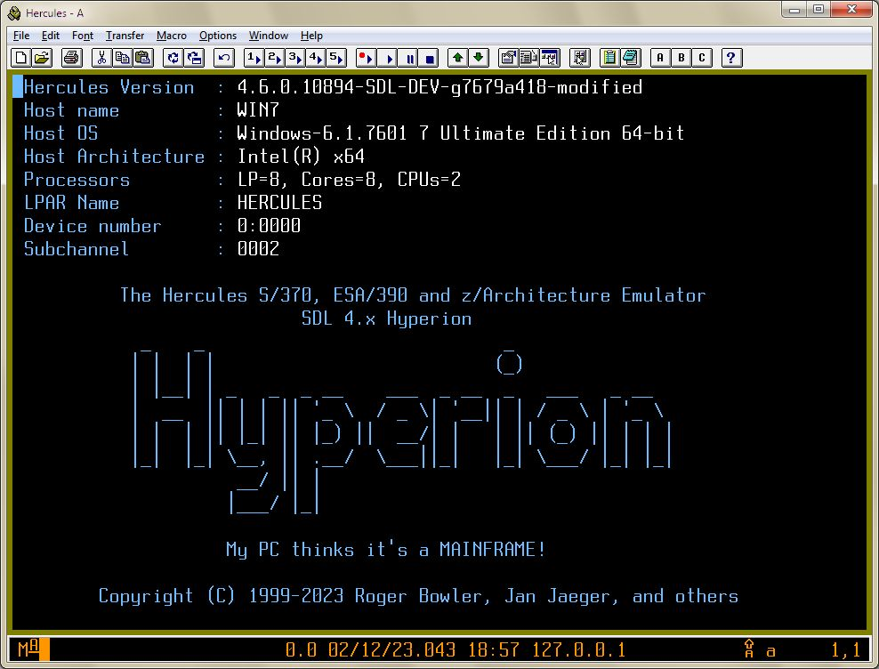

[Return to master README.md](../README.md)

# Customizable Hercules 3270 Logo

## Contents

1. [Customizable Hercules 3270 Logo](#Customizable-hercules-3270-Logo)
2. [How to specify the logo file](#How-to-specify-the-logo-file)
3. [How to create the logo file](#How-to-create-the-logo-file)

## Customizable Hercules 3270 Logo

The initial welcome screen presented when a TN 3270 terminal connects to a Hercules 3270 device can now be customized.
The customized logo is stored in a plain text file which contains positioning orders, attributes and variable substitutions.

&nbsp;

&nbsp;


Hercules also contains a built-in logo should no suitable file be found.
The built-in logo is contained in [cnsllogo.h](../cnsllogo.h) and is included in [console.c](../console.c).

## How to specify the logo file

Upon startup, Hercules will first look for a file named `herclogo.txt` in the current directory.
The logo file name can also be specified:

* As a startup option by using the `-b` flag.
* By using the `HERCLOGO` configuration statement.
(Note: The statement was previously `LOGOFILE`, but `LOGOFILE` has been deprecated).
* By using the `HERCLOGO` environment variable.
* At run time using the `HERCLOGO` panel command.

## How to create the logo file

Each line in the file represent either an order or a plain text line. The orders are as follows:
```
    @SBA X,Y          Position the current buffer position to Row X col Y (X and Y start at 0)  
    @SF [H][P]        Set the Highlight and/or Protected attribute  
    @NL               Forces going to the next line  
    @ALIGN NONE|LEFT|RIGHT|CENTER  
```

Specify text alignement relative to the left and right borders of the terminal. When `ALIGN` is other than `NONE`, a new line is automatically inserted after each line of text. If `ALIGN` is `NONE`, then the text will be written without skipping to the next line.

It is also possible to embed substitution variables in outgoing text.  Substition is indicated by enclosing the variable name between $( and ).

The following variables are defined in that environment:

Variable | Description...
--------------------- | -------------------------------------------------
$(BDATE)              | The build date of the emulator (e.g. "Mar 16 2020")  
$(BTIME)              | The build time of the emulator (e.g. "19:44:32")  
$(CCUU,ccuu,CUU,cuu)  | Various forms of the device number of the terminal  
$(CPUSERIAL)          | The CPUSERIAL value specified in the configuration file  
$(CPUMODEL)           | The CPUMODEL value specified in the configuration file  
$(CSS)                | The Logical Channel Subsystem Set or Channel Set for the terminal  
$(DATE)               | The current date in YYYYMMDD format  
$(HOSTARCH)           | The host architecture  (e.g. "Intel(R) x64")  
$(HOSTNAME)           | The host name on which Hercules is running  
$(HOSTNUMCPUS)        | E.g. "LP=8, Cores=8, CPUs=2"  
$(HOSTOS)             | The host operating system (e.g. "Windows")  
$(HOSTOSREL)          | The Host operating system release (e.g. "6.1.7601")  
$(HOSTOSVER)          | The host operating system version (e.g. "7 Ultimate Edition 64-")   
$(LPARNAME)           | The LPAR name specified in the configuration file  
$(SUBCHAN)            | The Subchannel number for the terminal  
$(TIME)               | The current time in HHMMSS format  
$(VERSION)            | The Hercules version  

Additionally, it is also possible to specify environment variable names.

The file [herclogo.txt](../herclogo.txt) is provided in the distribution as a sample template.
It reflects the contents of default the built-in logo.

Ivan Warren 3/1/2006  
Paul Gorlinsky 7/13/2011
