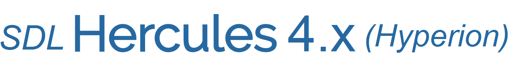

[Return to master README.md](../README.md)

# S/370 Backport of select ESA/390 and z/Architecture instructions: the `HERCULES_370_EXTENSION` facility

## Contents

1. [About](#About)
2. [Enabling the additional facility instructions](#Enabling-the-additional-facility-instructions)
3. [List of affected instructions](#List-of-affected-instructions)

# About

<!--- -------------------------------------------------------------------------------------------
                                ****  PROGRAMMING NOTE ****
      -------------------------------------------------------------------------------------------

      You can split long markdown lines into smaller more manageable multiple lines instead
      as long as each line (except for the last!) ends with a single newline with no preceding
      blanks. The very LAST line however (i.e. the end of the paragraph), *MUST* end with at
      least ONE (or more) blanks preceding the newline.
      
      Markdown README files are easier to manage when you can use multiple lines rather than
      one very, very long long line!
      
      ------------------------------------------------------------------------------------------- -->

Some ESA/390 and z/Architecture features and their instructions are architecturally compatible with the
S/370 architecture.  Although they are not present in the [S/370 Principle of Operations
(GA22-7000)](http://www.bitsavers.org/pdf/ibm/370/princOps/GA22-7000-10_370_Principles_of_Operation_Sep87.pdf),
they are not in contradiction with the reference manual. 

For example, there is no contradiction for an instruction such as LHI (Load Halfword Immediate) to be
included as part of the S/370 architecture presented by Hercules. 

However, since such instructions were not part of the original architecture, it is necessary that these extensions
to the architecture be controlled at runtime. 

Originally, the fact that such and such facility or feature was built for such and such architecture could only be
controlled by a series of C preprocessor macros in the
[`feat370.h`](https://github.com/SDL-Hercules-390/hyperion/blob/Release_4.9/feat370.h),
[`feat390.h`](https://github.com/SDL-Hercules-390/hyperion/blob/Release_4.9/feat390.h) and
[`feat900.h`](https://github.com/SDL-Hercules-390/hyperion/blob/Release_4.9/feat900.h) header files. 

Before runtime control was available, a
[select number of features were made available in `feat370.h`](https://github.com/SDL-Hercules-390/hyperion/blob/Release_4.9/feat370.h#L80-L129)
and then commented out.  Removing the comment and rebuilding Hercules however, would then
make it possible to access those features in the S/370 architectural mode. 

Requiring the user to manually modify Hecules source code and then have to rebuild their own
custom version of Hercules for themselves in order to allow such instructions to be included
as part of the 370 instruction set however, seemed a little too much to ask of the casual
Hercules user. 

Today however, such architectural features (facilities) are controlled dynamically by the enablement
or disablement of a specifically named "facility", accompanied with an appropriately constructed
`GEN...` macro in the `opcode.c` source file for each instruction. 

For the 370 architecture, opcode.c's `GEN...` macro specifies `GENx370x...` for each instruction
that is formal part of the original 370 instruction set, and `GENx___x...` for those instructions
which were _not_ part of the original 370 instruction set. 

For each instruction that is _not_ part of the original formal 370 instruction set, but which is
defined as part of Hercules's "Extended" 370 instruction set, "`37X`" is used instead (i.e. `GENx37Xx...`). 

Additionally, each such instruction _must also_ be listed as being a formal part of Hercules's
`HERCULES_370_EXTENSION` facility. &nbsp;As a small example of the use of the `GEN...` macro,
please see [`opcode.c`](https://github.com/SDL-Hercules-390/hyperion/blob/Release_4.9/opcode.c#L3879-L3898). 

## Enabling the additional facility instructions

From the configuration file or hardware control panel, simply issue the commands: 

<pre>
    archlvl   370
    facility  enable  herc_370_extension
</pre>

This will enable&nbsp; _(or disable if_ `'disable'` _is specified instead)_ &nbsp;the currently defined
backported instructions to then be available&nbsp; _(or unavailable)_ &nbsp;in System/370 mode. 

## List of affected instructions

For the current list of affected instructions, refer to the
[`BEG_DIS_FAC_INS_FUNC( herc37X )`](https://github.com/SDL-Hercules-390/hyperion/blob/a80b026bd17e31add2839d042b9d1deb9f98d3c3/facility.c#L4298-L4576)
section of the
[`facility.c`](https://github.com/SDL-Hercules-390/hyperion/blob/a80b026bd17e31add2839d042b9d1deb9f98d3c3/facility.c)
source file. 

&nbsp;
&nbsp;
&nbsp;
