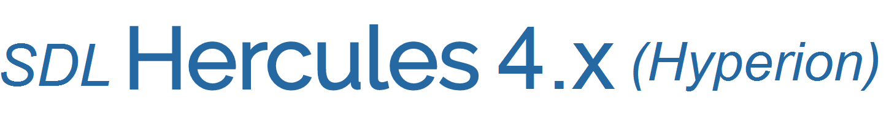

[Return to master README.md](../README.md)

# S/370 Backport of select ESA/390 and z/Architecture instructions

## Contents

1. [About](#About)
2. [Enabling the additional instructions](#Enabling-the-additional-instructions)

# About

Some ESA/390 and z/Architecture features and their instructions are architecturally compatible with the S/370 architecture.  Although they are not present in the S/370 Principle of Operations (GA22-7000), they are not in contradiction with the reference manual.

For example, there is no contradication for an instruction such as LHI (Load Halfword Immediate) to be included as part of the S/370 architecture presented by Hercules.

However, since these instruction are not part of the original architecture, it is necessary that these extensions to the architecture be controlled at runtime.

In Hercules, the fact that such and such facility or feature is built for such and such architecture is controlled by a series of C preprocessor macros in the [feat370.h](../feat370.h), [feat390.h](../feat390.h) and [feat900.h](../feat900.h) header files.

Furthermore, the availability of the instructions is controlled by Operation code tables in [opcode.c](../opcode.c).

Before runtime control was available, a select number of features were made available in [feat900.h](../feat900.h) and then commented out.  Removing the comment and rebuilding Hercules then made it possible to access those features in the S/370 architectural mode.

However, requiring a rebuild seemed a little too much to ask of the casual Hercules user since it would mean they would have to manually build a custom version of Hercules for themselves, which is not something a casual user of Hercules is necessarily prepared to do.

## Enabling the additional instructions

From the configuration file or hardware control panel, simply issue the commands:

```
    archlvl   370
    facility  enable  herc_370_extension
```

This will enable all currently defined backported instructions to then be available in System/370 mode.
For the current list of affected instructions refer to the `BEG_DIS_FAC_INS_FUNC( herc37X )` section
of the [facility.c](../facility.c) source file.
